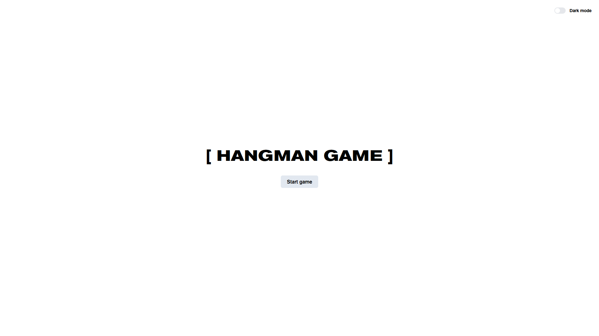

# 🎯 Hangman Game (Виселица)

Классическая игра «Виселица», реализованная на чистом JavaScript. Угадывай слово по буквам, пока не построишь всю виселицу!

🔗 **Демо:** [Посмотреть игру в браузере](https://mixddddd.github.io/hangman-game/)



## 🚀 Функциональность

- Случайный выбор слова из встроенного словаря
- Ввод букв с физической и экранной клавиатуры
- Отображение угаданных букв, оставшихся попыток
- Визуализация виселицы на каждом неверном шаге
- Защита от повторного ввода одной и той же буквы
- Сообщения о победе/поражении, возможность начать заново
- Переключение между светлой и тёмной темой
- Адаптивная вёрстка

## 🛠️ Стек

- HTML5
- Tailwind CSS
- JavaScript
- Работа с DOM, обработка событий, игровая логика

## 📂 Как запустить локально

1. Склонируй репозиторий:
   ```bash
   git clone https://github.com/mixDDDDD/hangman-game.git
   ```
2. Перейди в папку проекта:

   ```bash
   cd hangman-game
   ```

3. Открой index.html в браузере (или запусти через Live Server в VS Code).
